<!-- Animated header -->


<!-- Typing animation: edit the lines= values to change what is typed -->
<p align="center">
  <a href="https://github.com/CmdMayank">
    
  </a>
</p>

<p align="center">
  <a href="https://linkedin.com/in/sharmamayankk"></a>
  <a href="https://instagram.com/aka.mayankkk"></a>
  
</p>

---

## 👨‍💻 About Me

```python
class Mayank:
    role      = "AI & Full-Stack Developer"
    location  = "India 🇮🇳"
    focus     = ["LLM apps", "Web platforms", "Cloud deployment"]
    languages = ["Python", "C++", "Java", "C"]
    fuel      = "chai ☕ + curiosity"

    def current_mission(self):
        return "Building intelligent applications that solve real-world problems."
```

## 🔭 What I'm Up To

| | |
|---|---|
| 🔨 **Building** | _your current project here_ |
| 📚 **Learning** | _agents, RAG, fine-tuning, system design_ |
| 🤝 **Open to** | collaborations, internships, open-source |
| 💬 **Ask me about** | Python, AI/ML, full-stack, cloud deploys |

## 🛠️ Tech Stack

<p align="center">
  
</p>

## 🐍 Contribution Snake

<p align="center">
  <picture>
    <source media="(prefers-color-scheme: dark)" srcset="https://raw.githubusercontent.com/CmdMayank/CmdMayank/output/github-contribution-grid-snake-dark.svg" />
    <source media="(prefers-color-scheme: light)" srcset="https://raw.githubusercontent.com/CmdMayank/CmdMayank/output/github-contribution-grid-snake.svg" />
    
  </picture>
</p>

## 📊 GitHub Stats

<p align="center">
  
  
</p>

<p align="center">
  
</p>

## 🏆 Trophies

<p align="center">
  
</p>

## 💡 Dev Quote &amp; Joke (new on every refresh)

<p align="center">
  
</p>
<p align="center">
  
</p>

<!-- Animated footer -->

